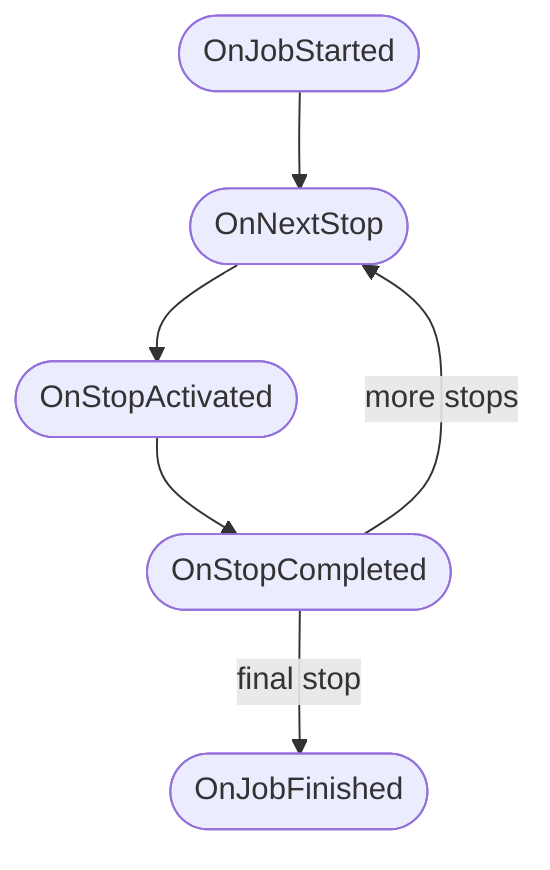

# Bus Module

The bus module exposes TruckersMP's bus gameplay: the active job, its stops,
passenger counts, and every step of a route from departure to final stop. It is
an [intent-gated](intents.md) module with a public intent.

Include the bus module's wrapper alongside the main header:

```cpp
#include <TruckersMP/TruckersMP.hxx>
#include <TruckersMP/Bus.hxx>
```

## Attaching

```cpp
static std::unique_ptr< TruckersMP::BusModule > g_bus;

// Inside truckersmp_init, after Session::Create succeeded:
g_bus = TruckersMP::BusModule::Attach( *g_session );
```

`Attach` unlocks the bus intent and resolves the module's tables. It returns
`nullptr` when the client refuses or predates the module; guard your bus
features behind that check. The module and the session may be destroyed in
either order.

## The model

- A **job** is one bus route: an ordered list of stops and passengers on board.
  At most one job is active at a time.
- A **stop** is one station on the route: a city, a schedule, and passengers
  boarding or leaving there.

Both are [handles](../concepts/data-and-handles.md): the job handle is valid
while the job is active, a stop handle while its job keeps it in scope. Get the
current job at any time:

```cpp
std::optional< BusJob > GetJob() const;
```

### BusJob

| Getter | Returns | Notes |
| --- | --- | --- |
| `GetStops()` | `std::vector< BusStop >` | Every stop on the route, in driving order. |
| `GetStartTime()` | `Uint32` | Economy time when the job started. |
| `GetPassengerCount()` | `Uint32` | Passengers currently on board. |

### BusStop

| Getter | Returns | Notes |
| --- | --- | --- |
| `GetName()` | `std::string` | Display name; currently the localized city name. |
| `GetCityIdentifier()` | `std::string` | The unit name of the stop's city (e.g., `city.prague`). |
| `GetScheduledTime()` | `Uint32` | Economy minutes it may take to drive to this stop (from the previous one). Reads 0 until `OnJobDataReady` fires. |
| `GetPlannedDistance()` | `Float` | Planned distance in km from navigation data. Reads 0 until `OnJobDataReady` fires. |
| `GetBoardingPassengers()` | `Uint8` | Passengers boarding at this stop. |
| `GetLeavingPassengers()` | `Uint8` | Passengers leaving at this stop. |

## Events

The module raises an event for every step of a route's life:

| Event | Fires when |
| --- | --- |
| `OnJobStarted` | A valid bus job was created; the estimate is the expected payout for the full route. |
| `OnJobDataReady` | The navigation data finished calculating; carries the stops with fresh schedules and distances. |
| `OnJobCanceled` | The job was canceled. It includes the reason why the job was canceled. |
| `OnJobFinished` | The job completed. It contains the payout (the earned amount). |
| `OnNextStop` | Routing to the next stop began. |
| `OnStopActivated` | The bus stopped at a stop and passengers are boarding. |
| `OnStopCompleted` | Boarding finished; ready to continue. It carries the driven distance for that stop. |

### Event order

A job raises its events in a fixed order:

1. `OnJobStarted` always comes first.
2. Each stop then runs one cycle, in driving order:
    1. `OnNextStop` when routing to the stop begins.
    2. `OnStopActivated` when the bus halts there.
    3. `OnStopCompleted` when boarding ends.
3. After the final stop's cycle, `OnJobFinished` closes the job.



Two events sit outside the cycle:

- `OnJobDataReady` fires once per job, after `OnJobStarted`, as soon as the
  game finishes calculating the schedules and planned distances. Its timing
  against the stop cycle is not fixed; until it fires, `GetScheduledTime()`
  and `GetPlannedDistance()` read 0.
- `OnJobCanceled` follows no schedule: it may fire at any point after
  `OnJobStarted` and ends the job on the spot; no further events fire for
  that job. Every job therefore closes with exactly one of `OnJobFinished`
  or `OnJobCanceled`.

It is worth noting that the closing event is your last chance to read the job;
once its callback returns, the job handle and its stop handles go stale.

Cancelation reasons (`BusJobCancellationReason`):

| Reason | Meaning |
| --- | --- |
| `ExistingJob` | A new job replaced an already active one. |
| `Abandon` | The player abandoned the job. |
| `Incompatible` | A loaded save did not meet the job's requirements. |
| `ExternalSource` | Canceled from outside; exact cause unknown. |

## Example: a route board

```cpp
g_bus->OnNextStop.Register( []( TruckersMP::BusNextStopEvent &e )
{
    TruckersMP::BusStop stop = e.GetStop();

    const std::string name = stop.GetName().value_or( "next stop" );
    const TruckersMP::Float distance = stop.GetPlannedDistance().value_or( 0.0f );
    const TruckersMP::Uint8 boarding = stop.GetBoardingPassengers().value_or( 0 );

    char text[ 200 ];
    std::snprintf( text, sizeof( text ), "Next: %s (%.0f km, %u boarding)",
                   name.c_str(), distance, boarding );

    g_session->UserInterface().ShowNotification(
        TruckersMP::NotificationType::Normal, text );
} );

g_bus->OnJobFinished.Register( []( TruckersMP::BusJobFinishedEvent &e )
{
    char text[ 200 ];
    std::snprintf( text, sizeof( text ), "Route complete! Payout: %lld", e.GetPayout() );

    g_session->UserInterface().ShowNotification(
        TruckersMP::NotificationType::Success, text );
} );
```
